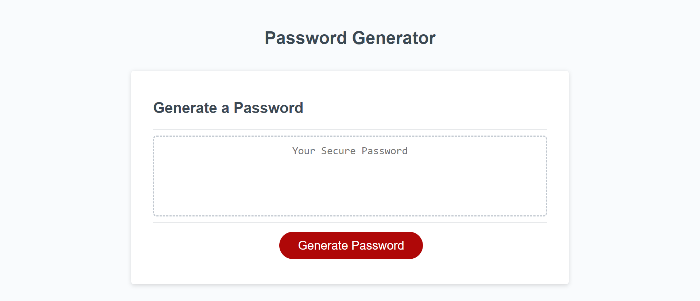
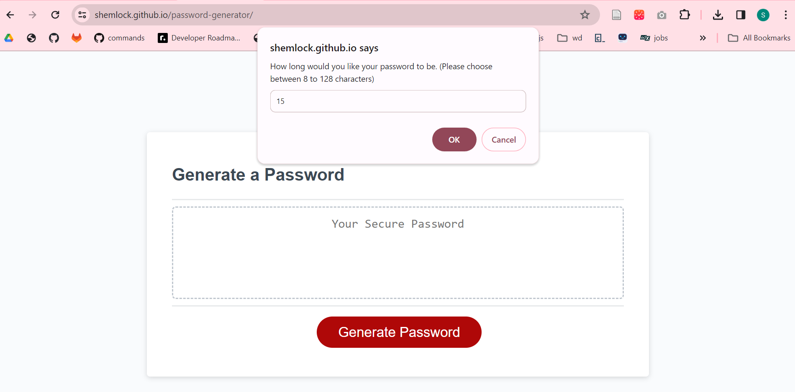
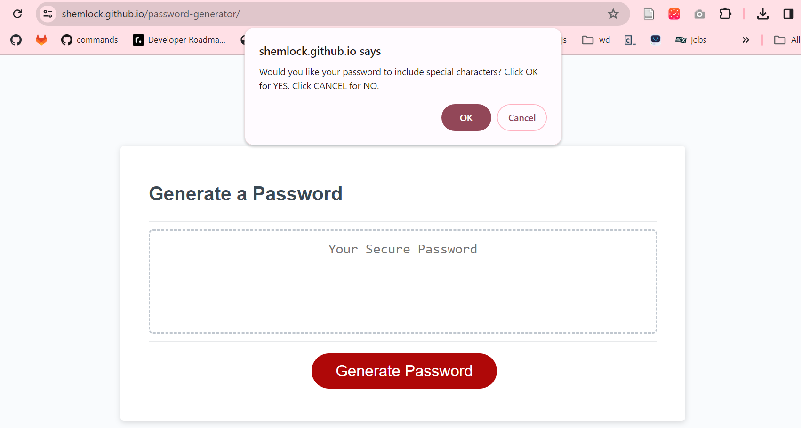
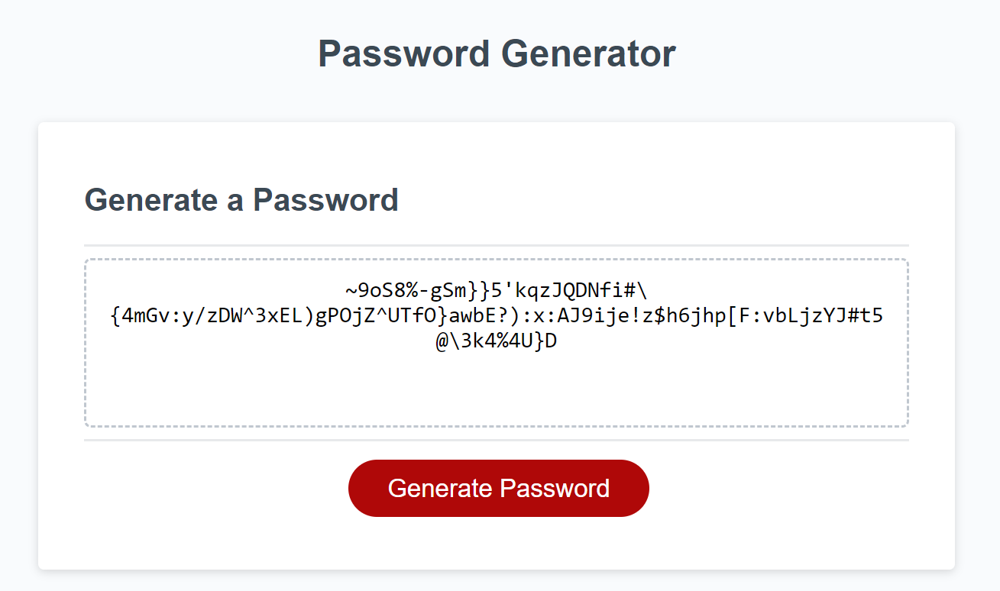

# Password Generator
The link to the deployed application is available here: https://shemlock.github.io/password-generator/

## Description

Password Generator is a simple browser application that generates passwords based on user input. 

The motivation for this project was to allow users to generate a random password based on their preferences regarding password length and whether or not they'd like the password to include numbers, special characters, upper case characters and lower case characters. Having different passwords for all your accounts online is crucial for protecting yourself from cyber attacks like credential stuffing. Password Generator makes it easy to have strong and unique passwords! 

  Creating this website helped me learn about: 
  * Javascript
  * Functions
  * For Loops
  * If statements
  * Arrayas

## Table of Contents

- [Installation](#installation)
- [Usage](#usage)
- [Credits](#credits)
- [License](#license)
- [Features](#features)
  
## Installation
N/A

## Usage
* Scroll back up to the top of this README.md file to see a screenshot of the full webpage, you will also be able to see a link to the deployed application.
  
* Click on the link to open the website.
  
* Click the red button that says generate password.
  
* You will then see a prompt that asks you how long your password should be (as seen in the image below). Please type in your desired number of characters for your password. 

* You will then see a series of prompts (like the one in the image below) asking if you would like special characters, numbers, uppercase or lowercase characters in your password. For each of these please click OK if you would like your password to include that character type and click cancel if you do not want your password to include it. 

* A password will then be generated for you as illustrated in the example below. 

  
## Credits
N/A

## License
MIT 

## Features

* Prompts user to input password preferences.
* Preferences include length, special characters, upper case, lower case and numbers.
* Alerts for if incorrect info is inputted (eg a password only 2 characters long , when the minimum is 8). 
* Password is generated based on user preferences. 

